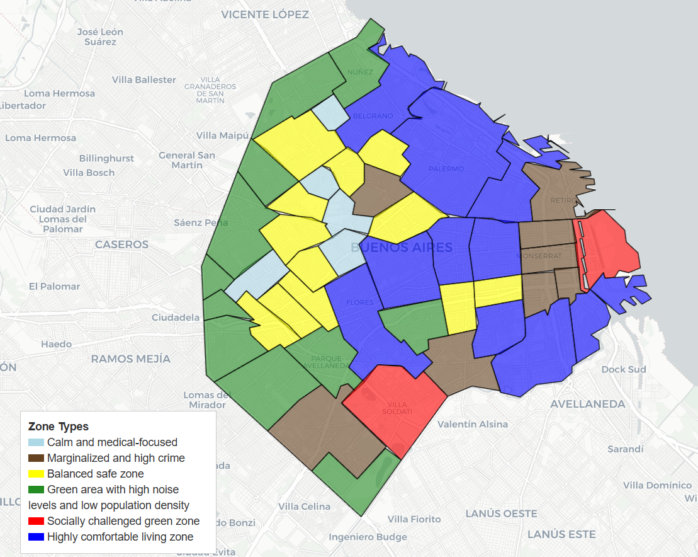

# 🧠 Classifying Buenos Aires Neighborhoods by Quality of Life

This project utilizes open geospatial and socio-economic data to classify the neighborhoods of Buenos Aires, Argentina, into meaningful clusters based on quality of life, infrastructure, safety, and environmental indicators.

The result is an interpretable, interactive map showcasing distinct urban zones, supported by unsupervised machine learning and thoughtful feature engineering.

---

## 📍 Project Goals

- Aggregate and process diverse datasets about Buenos Aires neighborhoods.
- Engineer meaningful features (e.g., slum density, crime rate, green space percentage).
- Apply PCA and KMeans clustering to detect quality-of-life zones.
- Visualize spatial patterns through interactive and static maps.

---

## 🧩 Methods & Tools

- **Data Engineering:** geopandas, pandas, shapely  
- **Modeling:** PCA, KMeans (scikit-learn)  
- **Visualization:** seaborn, matplotlib, folium  
- **Clustering validation:** Elbow & Silhouette methods  
- **Mapping:** choropleth maps + interactive map with popup tooltips

---

## 🗃 Data Sources

- Gobierno de la Ciudad de Buenos Aires – [data.buenosaires.gob.ar](https://data.buenosaires.gob.ar/)
- Slum boundaries – [Wikipedia](https://de.wikipedia.org/wiki/Liste_der_informellen_Siedlungen_in_Buenos_Aires)
- Population census – INDEC 2010
- Open shapefiles – GeoBA, BA Data

---

## 🧠 Key Features Engineered

- `slum_density`, `crime_per_1000`, `green_area_pct`, `hospitals_per_1000`, `schools_per_1000`
- `day_noise`, `night_noise`, `station_count`, `population_density`
- 24 total features, reduced to 10 via PCA

---

## 📊 Clustering Results

Using PCA and KMeans, neighborhoods were grouped into 6 clusters, each assigned a human-readable label such as:

- “Highly comfortable living zone”
- “Balanced safe zone”
- “Marginalized and high crime”
- ...

These clusters reflect complex urban dynamics and offer insights for planning and social understanding.

---

## 🌐 Final Map (Interactive)

📌 [Open the interactive map here](https://monumental-lebkuchen-b61a81.netlify.app/)  
(*Click on neighborhoods to explore zones and features!*)

---

## 📁 Repository Structure
root/ ├── data/ # Raw and processed datasets 
      ├── notebooks/ # Three Jupyter notebooks (EDA, Clustering, Visualization) 
      ├── outputs/ # Saved files (map, processed data, charts) 
      ├── README.md 
      ├── requirements.txt

---

## 📌 Notebooks

| Notebook | Purpose |
|----------|---------|
| `01_data_cleaning.ipynb` | Data loading, preprocessing, and feature engineering |
| `02_clustering.ipynb`    | PCA, clustering, and cluster analysis |
| `03_visualization.ipynb` | Static and interactive visualizations |

---

## 🎥 Presentation

📄 [Download the Project Presentation (PDF)](presentation/BA_Neighborhoods_Clustering_Presentation.pdf)

The presentation summarizes the project goals, methodology, clustering results, and final visualizations.

---

## 🙋 Author

**Ivan Osipov**  
📍 Based in Buenos Aires  
💼 Data Scientist  
🌐 [LinkedIn Profile](https://www.linkedin.com/in/ivan-osipov-dsml/)
